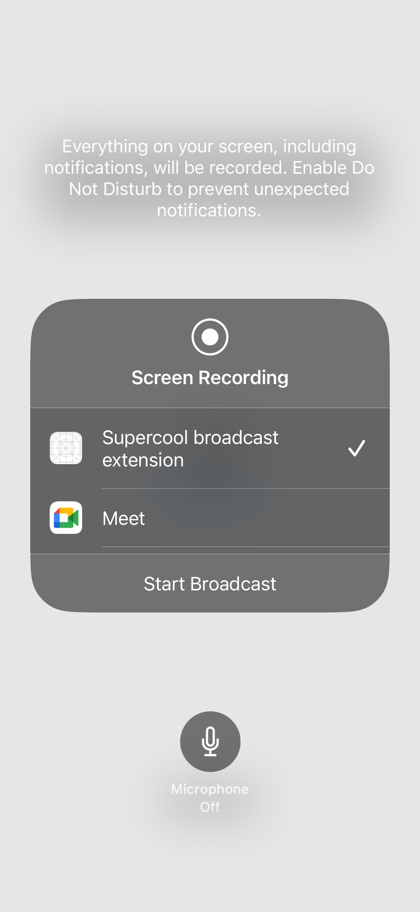
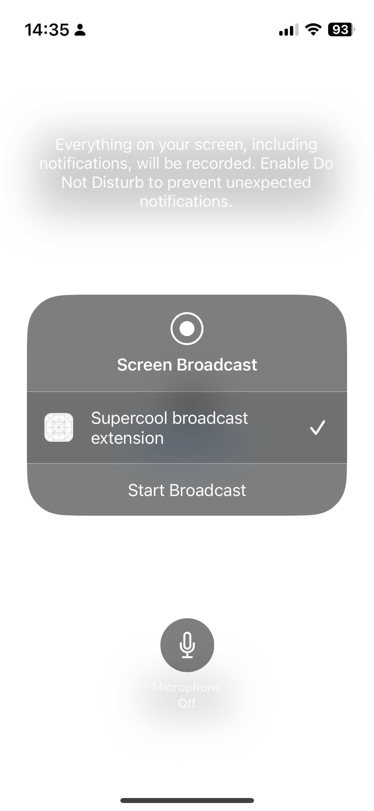

# Streamování iOS obrazovky

## Úvod
Cílem tohoto projektu je experimentální ověření možností streamování obrazovky v systému iOS za účelem sledování reakcí uživatele např. při ovládání aplikace hodnocené v rámci průzkumu. Pro samotné streamování je uvažována integrace služby Twilio. 

Konkrétními body pro ověření jsou streamování:
* Obrazovky při běhu aplikace na pozadí
* Zvuku z mikrofonu
* Čelní kamery

## Možnosti záznamu obrazovky
Pro záznam obrazu v systému iOS slouží knihovna `ReplayKit` a nabízí možnost záznamu obrazovky, ale i streamování obrazu pomocí rozšíření systému. Konkrétně nabízí dvě rozšíření, která slouží pro:
* Odesílání obrazu a zvuku na server streamovací služby (Broadcast Upload Extension)
* Nastavení parametrů streamování před spuštěním (Broadcast Setup UI Extension)

Streamování obrazu se spouští prostřednictvím systémového UI, které uživatel může vyvolat přímo ze systému (v Control Center) nebo prostřednictvím aplikace. Pokud uživatel vyvolá streamovací dialog prostřednictvím Control Center, systém mu nabídne možnost vybrat si libovolné rozšíření, ale pokud mu jej zobrazí konkrétní aplikace, je možné výběr zúžit na námi vybrané rozšíření.
Dialog z Control Center |  Dialog z aplikace
:-------------------------:|:-------------------------:
  |  

_Vzhledem k tomu, že je možné stream spustit i mimo hlavní aplikaci, je důležité pamatovat na implementaci rozšíření "Setup UI", případně na ošetření tohoto stavu prostřednictvím chybového hlášení uživateli._

## Broadcast Setup UI Extension

Aby streamování obrazovky mohlo nastartovat, typicky potřebuje nějaké vstupní informace jako je identifikátor streamu, autorizační token apod. Tyto informace je možné předat z aplikace do streamovacího rozšíření, nicméně pokud uživatel spustí rozšíření přímo ze systému, pravděpodobně nebude mít všechny údaje k dispozici. V tomto případě je možné vytvořit rozšíření, obrazovku, pomocí které je může uživatel zadat.  

## Snímání obrazovky

Broadcast Upload Extension standardně dostává od systému snímky obrazovky, které je nutné zpracovat a následně odeslat na server.  

Jednotlivé aplikace mohou získávat od systému informace o tom, že je obrazovka zaznamenávána a mohou implementovat bezpečnostní opatření, která v danou chvíli omezí to, co je na displeji vidět. Můžeme předpokládat, že toto by pro zamýšlený účel záznamu obrazovky nemělo být omezující, neboť primárním cílem je sledování reakcí uživatele a ne získávání konkrétních či citlivých dat z displeje uživatele. Také můžeme předpokládat, že drtivá většina aplikací nebude nic kromě hesel skrývat.

_Při implementaci tohoto rozšíření je obzvláště důležité dát si pozor na spotřebu prostředků systému, především paměti, která je poměrně omezená (50MB), a je tudíš nutné obraz a práci s ním optimalizovat._

## Snímání zvuku

Rozšíření pro streamování obrazovky standardně podporuje záznam zvuku jak ze systému zařízení, tak z mikrofonu zařízení. Dialog sloužící pro výběr streamovací služby a odstartování záznamu obrazovky nabízí uživateli možnost mikrofon zapnout či vypnout. Pokud zde uživatel mikrofon nezapne (viz ikona / tlačítko mikrofonu na screenshotech výše), rozšíření zvuk z mikrofonu dostávat nebude.  

Na přednáškách od Applu je ukázána funkcionalita v aplikaci, pomocí které je možné mikrofon zapnout a vypnout programově, ale při reálném ověření se ukázalo, že toto možné není. Pravděpodobně v přednášce přešli od ukázky streamování k ukázce záznamu obrazovky aplikace, nebo již v novějších verzích iOS toto nefunguje (původní implementace ReplayKitu je z roku 2016 a přednášky již nejsou v oficiálních zdrojích dostupné).  

Pro úplnost stojí za zmínku, že pokud je mikrofon povolený, rozšíření dostává zvuk ze zařízení a z mikrofonu najednou jako dva separátní streamy. Implementaci je následně nutné tomuto přizpůsobit. Např. implementace Twilio SDK podporuje pouze jeden stream, proto je nutné si vybrat zvuk z mikrofonu a nebo zvuk ze zařízení, případně oba streamy "smíchat" dohromady pomocí `AVFoundation`.

## Snímání obrazu z čelní kamery

V rámci aplikace je možné zaznamenávat reakce uživatele prostřednictvím čelní kamery a to tak, že se její obraz zobrazí v rámci aplikace např. jako plovoucí okno. Toto je možné udělat pomocí připraveného `View` od `ReplayKitu`, nebo standardně vlastní implementací `AVFoundation`. V každém případě je ale zobrazení obrazu z čelní (či jiné) kamery možné pouze v rámci aplikace. Pokud ji uživatel přesune na pozadí a přejde do jiné aplikace, obraz z kamery, který je součástí původní aplikace, vidět nebude. 

V rámci PoC bylo také experimentálně vyzkoušeno chování fotoparátu (kamery) v rámci **Broadcast Upload Extension**, ale systém mu odmítá poskytnout obraz z kamery i když identická implementace je v rámci aplikace jako takové plně funkční. Získat obraz z kamery během spuštěného záznamu je možné v rámci aplikace, nicméně v rámci tohoto rozšíření to možné není. Jedná se tedy nejspíše o omezení systému kvůli bezpečnosti soukromí uživatele.

## Platforma Twilio

Twilio v rámci ukázky implementace jejich SDK do aplikací také zpřístupnilo ukázku implementace **Broadcast Upload Extension**. Tuto ukázku se nepodařilo zprovoznit, jelikož vyžaduje server pro streamování videa (např. zprovoznění lokálního serveru na zařízení). Nicméně po prozkoumání implementace mohu konstatovat, že jejich implementace odpovídá informacím získaným z oficiálních zdrojů a z experimentálního prozkoumání `ReplayKitu`.  

Součástí ukázky implementace od Twilio jsou dvě důležité části, kterými je dobré se v rámci implementace inspirovat či řídit a to práce s jejich SDK a hlavně optimalizace zpracování obrazu od systému tak, aby bylo možné je odeslat na jejich servery, hlavně s přihlédnutím k omezením zdrojů zmíněným výše.

_Dle informací v dokumentaci přestalo Twilio přijímat nové zákazníky s tím, že stávajícím zákazníkům bude služba fungovat do 5.12.2024. Twilio doporučuje přechod na platformu Zoom a připravilo [manuál](https://developers.zoom.us/docs/video-sdk/twilio/) pro usnadnění přechodu._

## Shrnutí

Hlavními body pro ověření bylo stremování obrazovky při běhu aplikace na pozadí, záznam zvuku a obrazu z čelní kamery.  
Implementací **Broadcast Upload Extension** je možné dosáhnout streamování obrazovky a zvuku na server s tím, že pro záznam zvuku z mikrofonu zařízení je nutné, aby uživatel při spouštění streamu mikrofon zapnul pomocí tlačítka, které nativní dialog nabízí.  
Záznam obrazu z čelní kamery je možný pouze v rámci aplikace. Obraz z kamery zařízení tedy není dopstupný pokud je aplikace na pozadí.

Dle informací z dokumentace Twilio vyplývá, že 5.12.2024 tato služba přestane fungovat, je proto důlžité zajistit funkčnost aplikace i po tomto datu, např. přechodem na jiné SDK (Twilio doporučuje Zoom SDK).

## Zdroje

_Některé zdroje nebylo jednoduché najít, proto je zde seznam hlavních využitých zdrojů pro budoucí referenci._

Twilio:
* [Dokumentace](https://www.twilio.com/docs/video/ios)
* [Migrace na Zoom SDK](https://developers.zoom.us/docs/video-sdk/twilio/)
* [Example GitHub](https://github.com/twilio/video-quickstart-ios)

Apple WWDC přednášky:
* [Live screen broadcast with replaykit](https://www.youtube.com/watch?v=i-Sa5kgiRyQ)
* [Go Live with ReplayKit](https://wwdctogether.com/wwdc2016/601)
* [What's New with Screen Recording and Live Broadcast](https://www.youtube.com/watch?v=jCpLO3OfF8E)

Práce s kamerou ve SwiftUI:
* [Video Recorder App with SwiftUI](https://enebin.medium.com/step-by-step-visual-guide-to-developing-a-video-recorder-app-with-swiftui-864f842d28a0)